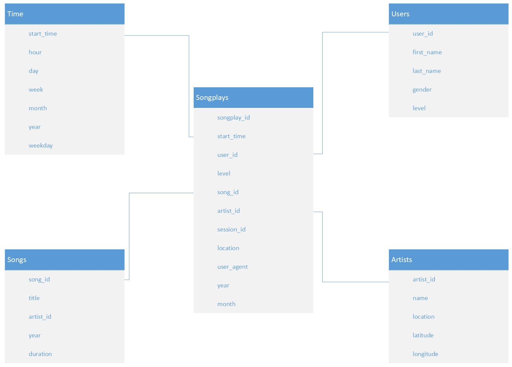

This directory contains the files for the project "Data Lakes." The project is a set of exercises to learn to use Spark to create a Star Schema optimized for Analytics queries.

## Purpose

Sparkify is providing its users with enriched metadata of who is playing next on a music service. They are pulling artist and song data from an API (or from a data dump) and then use another API to obtain User Play data. There are multiple challenges to this service. The first challenge is having a complete database of all artists and songs, and the second one is matching the log information to the artist's name in their respective tables. 

Current log information contains artists from multiple countries in different languages, as well as extraneous symbols. Also, they have songs with multiple singers represented in long strings with no standard convention. 

Sparkify wants to make sure they can detect anomalies in the artist and song names in their log data, and they also want to keep growing their artists and songs datasets to provide enriched metadata to their users. Their goals are to continue building their data pipeline as they tackle solutions to each of these complex problems.

Our schema has a single Fact Table that will house the records of the songs played.

All tables will be saved as Parquet files in S3.

### Fact Table - Songplays

  - `songplay_id`
  - `start_time`
  - `user_id`
  - `level`: Denotes whether the play is free or paid.
  - `song_id`
  - `artist_id`
  - `session_id`: Denotes the User Session.
  - `location`: US City and the State of Songplay.
  - `user_agent`: Browser User Agent (soon to be deprecated), might be a good idea to revise API.

### Dimension Tables

#### Users

  - `user_id`
  - `first_name`
  - `last_name`
  - `gender`
  - `level`

#### Songs
  - `song_id`: Enforces Pipeline to sanitize input
  - `title`
  - `artist_id`
  - `year`
  - `duration`

#### Artists
  - `artist_id`: Enforces Pipeline to sanitize input
  - `name`
  - `location`
  - `latitude`
  - `longitude`

#### Times

A lot of information in this table is redundant, and we likely can remove it in favor of storing an ISO String. The ISO String would need to be transformed by every client of the data, but this means encoding all relevant information in a single string. This change would reduce the possibilities of stale or wrong data in case of a pipeline bug. 

  - `start_time`
  - `hour`
  - `day`
  - `week`
  - `month`
  - `year`
  - `weekday`

### ETL Justification

We output all resulting tables as Parquet Files which is overall smaller than JSON or CSV and more performant on SparkSQL.[^1]

## Project Structure:

  - `R&D.ipynb`: Notes and logic on how each table is Created
  - `dlcfg`: AWS Configuration
  - `etl.py`: Pipeline code
  - `README.md` Report
  
[^1]: 
Ivanov, T., & Pergolesi, M. (2020). The impact of columnar file formats on SQL‐on‐hadoop engine performance: A study on ORC and Parquet. Concurrency and Computation: Practice and Experience, 32(5), e5523.